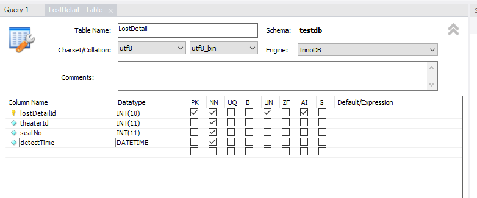

# LostDetection
Arduino or RaspberryPi  Detects > Connects > Sends Detect information to MySQL server. 
This is a respository contains php/other codes for LostandFound IoT System(backend) 

-------------------
## MySQL :: LostDetail Table
* LostDetection process inserts Lost detection infos to LostDetail table which shown in following picture 

